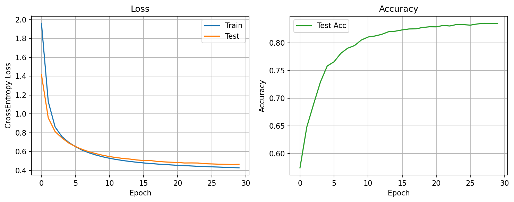
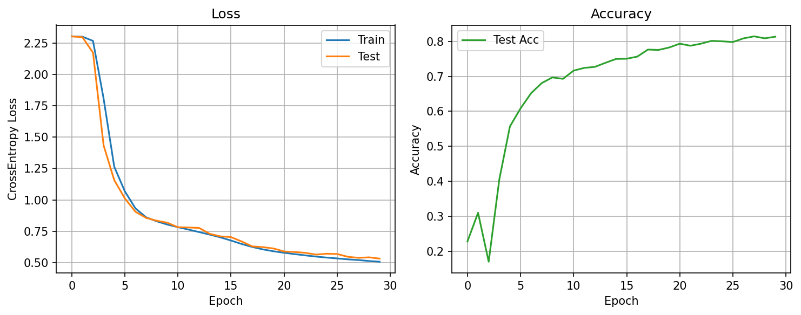
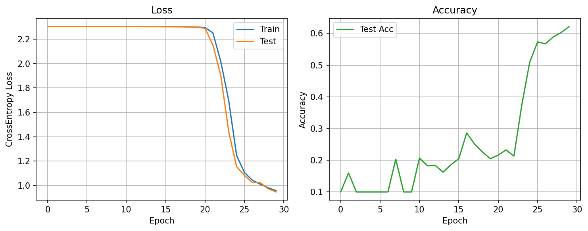

# MLP Depth and Gradient Experiments

This directory contains small, from-scratch PyTorch experiments that study how
the depth of a multilayer perceptron (MLP) affects FashionMNIST classification.
The models use PyTorch tensors and autograd, but define their parameters, forward
passes, L2 regularization, and SGD updates manually instead of using
`torch.nn.Module` or `torch.optim`.

## Experiment goal

The main comparison keeps every hidden layer at 100 units while changing the
number of affine layers. This makes it easier to observe the effect of increasing
depth while keeping the hidden-layer width fixed.

| Script | Architecture | Epochs | Additional output |
| --- | --- | ---: | --- |
| `2layer_mlp_classifiaction.py` | 784 → 100 → 10 | 100 | Loss, accuracy, and hidden-layer gradient norms |
| `3layer_mlp_classification.py` | 784 → 100 → 100 → 10 | 100 | Loss, accuracy, and hidden-layer gradient norms |
| `4layer_mlp_classification.py` | 784 → 100 → 100 → 100 → 10 | 100 | Loss, accuracy, and hidden-layer gradient norms |

ReLU is applied after every hidden affine layer. The output layer produces ten
logits, and training uses cross-entropy loss.

> Note: `classifiaction` in the two-layer filename is the current filename and
> includes a spelling error.

## Training configuration

The scripts currently use:

- FashionMNIST images flattened from `28 × 28` to 784 features
- batch size: 128
- learning rate: 0.01
- L2 coefficient (`lambd`): 0.001
- random seed: 42 for parameter initialization
- CUDA when available, otherwise CPU

The weight update is implemented explicitly. For a weight matrix `w`, it is
equivalent to:

```python
w -= lr * (w.grad + lambd * w)
```

Biases are updated without L2 regularization.

## Running an experiment

From the repository root, install the required packages if needed:

```bash
python3 -m pip install torch torchvision matplotlib numpy
```

Then run one of the scripts:

```bash
python3 experiments/mlp_resnet_rnn/2layer_mlp_classifiaction.py
python3 experiments/mlp_resnet_rnn/3layer_mlp_classification.py
python3 experiments/mlp_resnet_rnn/4layer_mlp_classification.py
```

FashionMNIST is downloaded automatically. At present, all three scripts use the
hard-coded dataset directory `/home/yan/proj/data`; change the `root` argument in
the scripts if that location is not suitable on your machine.

Each script prints whether CUDA is available and reports the elapsed time for
each epoch. Figures are saved under `figs/` before the interactive plot window is
shown.

## Generated figures

The scripts save their loss/accuracy curves and gradient measurements under
`figs/`. The main outputs are:

- `figs/2layer_mlp.png`
- `figs/2layer_grad_vs_layer.png`
- `figs/3layer_mlp.png`
- `figs/3layer_grad_vs_layer.png`

The four-layer script saves filenames containing its epoch count and learning
rate, for example:

- `figs/4layer_100_lr0.01_mlp_3.png`
- `figs/4layer_100_lr0.01_grad_vs_layer.png`

The gradient figure samples every 25 training batches. Each subplot represents
one selected epoch, and each line represents one sample within that epoch. In
the rendered plots, the horizontal axis runs from the input side toward the
output side:

```text
y_hat_1 (closest to input) → y_hat_2 → y_hat_3 (deepest)
```

The vertical axis is `log10` of the activation-gradient norm. Values are clipped
to at least `1e-12` before applying the logarithm, so zero gradients can be shown
without producing negative infinity. This plot can help reveal whether gradients
shrink or grow as they propagate toward earlier layers.

## Experimental results

### Experiment 1: effect of depth on convergence and accuracy

The three models use the same hidden width, initialization scale, learning rate,
regularization coefficient, batch size, and training duration. Under these
conditions, increasing depth does not automatically improve classification
accuracy.

| Model | Learning behavior | Final train accuracy | Final test accuracy |
| --- | --- | ---: | ---: |
| 2-layer | Learns immediately and converges smoothly | about 88% | about 86%–87% |
| 3-layer | Brief plateau followed by stable learning | about 88% | about 85%–86% |
| 4-layer | Remains near random prediction for about 20 epochs, then learns | about 87%–88% | about 85% |

#### Two-layer MLP



The two-layer model starts learning during the first epoch and reaches a useful
accuracy quickly. Its loss decreases smoothly, and the gap between training and
test accuracy remains small. For this task and training setup, one hidden layer
already provides enough capacity for a strong baseline.

#### Three-layer MLP



The three-layer model initially stays close to the random-classification loss
`log(10) ≈ 2.30`, but the plateau is much shorter than for the four-layer model.
After learning begins, it approaches the two-layer model's accuracy. The extra
layer therefore increases optimization difficulty without producing a clear
test-accuracy improvement in this run.

#### Four-layer MLP



The four-layer model shows the clearest delayed-learning behavior. For roughly
the first 20 epochs, its loss remains close to `2.30` and its accuracy remains
near the 10% random baseline. It then leaves the plateau and eventually reaches
about 85% test accuracy. Its final result is reasonable, but it requires many
more optimization steps to reach the same performance region as the shallower
models.

The important observation is therefore not only the final accuracy. With the
current initialization and optimizer, depth mainly changes **how easily and how
quickly the model can be optimized**.

### Experiment 2: gradient propagation across hidden layers

To investigate the delayed learning, the scripts retain the gradient of each
hidden activation after backpropagation. Every 25 batches, they record

```text
||∂loss / ∂y_hat_i||₂
```

and plot its base-10 logarithm. Each colored line (or point in the two-layer
case) is one sampled batch. `y_hat_1` is closest to the input, while the largest
index is closest to the output.

#### Two-layer gradient


Because this model has only one hidden activation, this figure cannot compare
propagation between layers. It serves as a reference for how the gradient scale
changes over training. The gradient becomes substantially larger after the
first epoch as the model moves away from its small initial weights.

#### Three-layer gradient


At epoch 1, the gradient at `y_hat_1` is roughly one order of magnitude smaller
than the gradient at `y_hat_2`. This is evidence that the gradient is attenuated
as it propagates toward the input. By later epochs, the absolute gradients have
grown and the relationship changes: `y_hat_1` can receive a larger gradient than
`y_hat_2`. The gradient problem is therefore strongest near initialization and
is not a fixed property throughout training.

#### Four-layer gradient


The four-layer model makes the initial attenuation more pronounced. At epoch 1,
the gradient becomes progressively smaller from `y_hat_3` to `y_hat_1`; the
first hidden activation is roughly two orders of magnitude below the deepest
hidden activation. This agrees with the long plateau in the loss curve: early
layers initially receive a much weaker learning signal.

After the model leaves the plateau, all three hidden-layer gradients increase.
From approximately epoch 30 onward, the plotted ordering reverses, with the
earlier hidden activation often having the larger gradient. This suggests that
the weights have moved into a more trainable regime. The plots support the
following explanation:

```text
small initialization
    → activation and gradient attenuation across more layers
    → weak updates to early layers
    → delayed departure from random prediction
    → larger, reorganized gradients once learning starts
```

### Conclusion

For these plain MLPs, adding layers increases representational capacity but does
not improve test accuracy under the current training recipe. The two-layer model
is the easiest to optimize and achieves the best test accuracy in this run. The
three- and four-layer models eventually reach similar performance, but their
early training becomes increasingly slow as depth increases.

The gradient measurements give a plausible mechanism for this result: all
weights are initialized with standard deviation `0.01`, so gradients are strongly
attenuated near initialization in the deeper networks. The observations do not
show that deeper networks are inherently worse; they show that deeper networks
are more sensitive to initialization and optimization choices.

### Limitations and next experiment

- The comparison currently uses only one initialization seed. Multiple runs are
  needed before treating small accuracy differences as meaningful.
- Hidden width is fixed, but parameter count increases with depth, so only width
  and training configuration—not total model capacity—are controlled.
- Training accuracy is accumulated online while parameters change during the
  epoch; test accuracy is evaluated afterward using the final parameters from
  that epoch. Early train/test values are therefore not perfectly comparable.
- Gradient norm shows scale, but not gradient direction, parameter-update size,
  activation sparsity, or the number of dead ReLU units.

A natural next experiment is to replace the fixed `0.01` initialization with He
initialization while keeping everything else unchanged:

```python
w = torch.randn(fan_in, fan_out, device=device) * np.sqrt(2.0 / fan_in)
```

If initialization is the main cause, the three- and four-layer loss curves
should leave `2.30` much earlier, and the epoch-1 gradient norms should vary less
dramatically across layers. Residual connections can then be added as a separate
experiment to test whether they further improve gradient flow.
